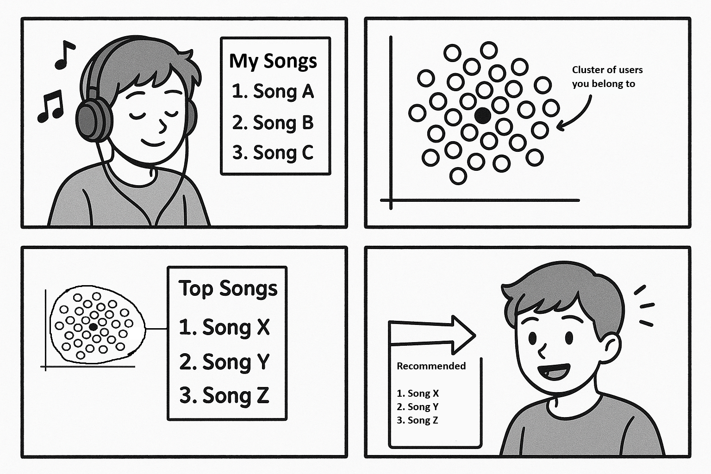

# Music-Recommender

This project aims to create song recommendations as a personalized playlist using the Million Song Dataset combined with
Nest User data.

Link to dataset:

http://millionsongdataset.com/pages/getting-dataset/#subset

## Introduction
Music is an integral part of many people’s lives. It’s on during the commute to work, playing in the background at coffee shops, and echoing through stores. Before the explosion of digital data people  curated playlists manually or discovered new music by conducting research. Now, information about musical works has become widely available. As a result, music platforms have started leveraging this data to enhance the listening experience. Modern platforms now offer features such as personalized song recommendations, auto-generated playlists, collaborative playlists, and even AI DJs. All of these rely on analyzing both user behavior and song characteristics to tailor music to individual tastes. However, sometimes the “personalization” can miss the mark. 

This project does not involve predicting exactly what songs a user will listen to, instead, its objective was to generate a set of recommended songs (a playlist) for each user based on observed user–song interaction data. This was conducted using the million song metadata and user-song interaction data. First, data exploration was conducted, the data was preprocessed, then two clustering algorithms were implemented and the results were analyzed. Music data is rich and complex, so it creates a really good environment for exploring clustering algorithms and this sector of machine learning while working on something we are passionate about. In this project, the focus is on improving the data and optimizing the models in order to create clusters that appropriately reflect different song/music preferences. Good predictive models allow organizations to make data driven decisions, increase efficiency, and reduce risks. In our particular case, ‘predicting’ what customers will like can create a personalized, enhanced user experience and give us valuable insights on user listening behavior. 

## Environment Setup (Local)

Downloading the subset from the official site is complicated, so please download the 3 initial files ("
train_triplets.txt", "track_metadata.db", "msd_tagtraum_cd2.cls") from the Google Drive folder and place all files in
the main project directory before running the code.
https://drive.google.com/drive/folders/1HDbRnlnZX_9-2XqVEZwiZabEKfR88BKA

**Required libraries:**

- **Python ≥ 3.13**
- **pandas**
- **polars**
- **pyarrow**
- **numpy**
- **matplotlib**
- **seaborn**
- **scikit-learn**
- **umap-learn**

## Environment Setup (Google Collab):

- The environment for this project is google colab + Google Drive
- The data was uploaded onto Google Drive
- In Google Drive create drive a folder called 'DSE'
- Then create a shortcut to the drive folder: https://drive.google.com/drive/folders/1t-1ueI5ETe1Io3TsyBkqkf3gaaftR9Al
- Run mount code in Google Collab
- Read csvs

## Google Collab Files:

The Milesstones can be run independently. However each milestone builds off the last.

- Milestone 2 - EDA: https://github.com/DirtyChay/music-recommender/tree/Milestone2 
- Milestone 3: https://github.com/DirtyChay/music-recommender/tree/Milestone3
- Milestone 4:
    - File 1: Data Retrieval and Aggregation
      https://colab.research.google.com/drive/1h_kU4OeoJo2ckthB4Nb0gZ5gtmtxEwX3

    - File 2: Data Preprocessing
      https://colab.research.google.com/drive/1WeXOa1ElvLiCviyM6z9mqvctxymc1OIk

    - File 3: Dimensionality Reduction, Clusterng and Model Evaluation
      https://colab.research.google.com/drive/1M1M9YJdQ6Trbz9RW_sMKrIaZAGUFY6RC

    - File 4: Song Recommendation and Further Cluster Evaluation
      https://colab.research.google.com/drive/1tefikJ3rhLLgSbNbZ2LNBseMEHwgnHMW
      
    - Data: https://drive.google.com/drive/folders/1hGWJrezEpd7SMbizWebN_Ku5nl1LAUAh?usp=drive_link

## Methods:

For a complete walkthrough of the project, including detailed explanations, figures, and code, refer to
the [full project report](https://github.com/DirtyChay/music-recommender/blob/Milestone4/REPORT.md.

### 1. Exploratory Data Analysis (EDA)

- **Data Sources:** Million Song Dataset – track metadata and user-song interactions.
- **Purpose:** Understand data structure, identify missing values, outliers, and patterns.
- **Visualizations Used:**
    - Numerical features: Histograms, strip plots, correlation heatmaps.
    - Categorical features: Bar charts, pie charts.
    - Example insights:
        - Artist familiarity and hotness had few missing values (-1 indicates missing).
        - Many songs had missing or zero year values, removed during preprocessing.
        - Popularity of genres: Rock most common, followed by electronic and pop.
        - Right-skewed distribution of song plays with extreme outliers captured via stripplots.

### 2. Data Preprocessing

- **Goal:** Prepare two main datasets for modeling and playlist generation:
    1. **Song-level DataFrame:** Contains user-song interactions merged with metadata and genre labels.
        - Dropped rows with missing genres and year = 0.
        - Created a new feature: `total_track_time = duration * plays`.
        - Saved as Parquet for easy access.
    2. **User-level DataFrame:** Aggregated user listening statistics for clustering.
        - Calculated total plays, total listening time, number of unique songs/artists.
        - Determined preference-based features: most-listened artist, favorite genres, most common release year,
          most-played song.
- **Feature Preparation:**
    - Dropped NaNs.
    - **Numerical variables:** Scaled using Min-Max and Robust scaling (Robust chosen for outliers).
    - **Categorical variables:** One-hot encoding for favorite genres and artist.
- **Dimensionality Reduction:**
    - Applied PCA to numerical features, retaining components explaining 90% variance.
    - Applied UMAP
- **Cluster Preparation:**
    - Used the elbow method on PCA-transformed data to find optimal k for K-means.
    - Constructed heatmaps to visualize cluster distributions across different k values.

### 3. Clustering Models

- **K-means Clustering**
    - Tested different numbers of clusters
    - Key parameters: n_clusters=(9 or 26), random_state=42, n_init='auto'
    - Evaluated using silhouette score on a subset of data and visualizations.
    - Output: Cluster labels assigned to each user.
- **HDBSCAN**
    - HDBSCAN automatically detects clusters and labels low-density points as noise.
    - Key parameters: min_cluster_size=200, min_samples=10, n_neighbors=50, min_dist=0.
    - Evaluated using visualizations
    - Output: Cluster labels assigned to each user.

### 4. Playlist Generation

- Merged user with cluster assigments with song-level data.
- Computed global song popularity.
- For each cluster for each algorithm (KMeans and HDBSCAN):
    - Ranked songs by cluster-specific popularity.
    - Selected top 20 songs per cluster
- Output: Cluster-level playlists for recommendation.
- User Top 20: Output User's top 20 songs
- Compare cluster playlists to user top songs

---

## Results

- **Preprocessing Results:**
    - After removing null genres and year = 0, the mean year for songs is 1998.
    - Pairplots showed that main numerical attributes (duration, artist familiarity, artist hotness, year) do not form distinct clusters by genre.
    - Duration is highly skewed; year shows spikes in 2000; artist familiarity and hotness are mid-range with weak correlation.
- **User-level Data:**
    - Correlation matrix showed strong correlations among activity features (total plays, total play time, unique songs/artists) but weak correlations for preference-based attributes.
- **Dimensionality Reduction:**
    - PCA retained 8 components explaining 91.19% of variance.
    - Elbow method suggested 9 clusters, but higher numbers produced more even cluster distributions.
- **KMeans:**
    - Silhouette score = 0.133, indicating weak separation.
    - Cluster sizes ranged from 1,432 to 55,442 users.
    - Visualization shows dense central region with substantial overlap.
- **HDBSCAN:**
    - Automatically selected 151 clusters, many small dense clusters and noise points.
    - Visualizations show overlapping clusters with meaningful local structure.
- **Playlist Results:**
    - User top 20 songs compared with cluster playlists.
    - Strong overlap for genres, moderate overlap for songs, artists, and years.
    - 50% overlap between KMeans and HDBSCAN clusters across all metrics.

## Discussion

- **EDA:** Crucial for understanding data structure, missing values, outliers, and feature distributions. Histograms, bar charts, and stripplots revealed skewness and extreme values.
- **Preprocessing:** Ensured clean input for clustering. Dropped rows with missing genres/year, scaled numerical variables, one-hot encoded categorical features. PCA reduced dimensionality while retaining 90% variance. Heatmaps showed higher cluster numbers gave more even distributions, guiding KMeans choices.
- **KMeans:** Chosen for simplicity and scalability. Captures linear patterns in user behavior.
- **HDBSCAN:** Complementary approach capturing non-linear patterns. Identifies dense local clusters and noise.

## Conclusion

- Users dilteration was done post initial model runs.
- Rerunning models after advanced feature engineering (augmenting data with genres, removing extreme outliers, removing non repeat customers) significantly improved results 
- We created our own cluster evaluation metrics by aggregating features for each clusters and averaging them. 
- We inspected the top songs of an arbitrary user and generaeted playlists based on the clusters it fit.
- We compared the songs, artists, genres and years to qualify the suggested playlists and check for overfitting and underfitting
- We would need actual user feedback to evaluate the playlists.
- Augmenting the data with actual song information would help improve the model to make more accurate clusters. 
- Adding the one hot encoded data for artist_id and song_id would help add nuance to the models.
- The user-user interactions that could be derived via shared songs or shared genre would also be helpful for measuring similarity between two users. 
- The users, songs and plays data forms a bipartite graph where plays are the links between user and song nodes and the play counts is the weight
- Graph based machine learning methods utilize the interrelated nature of the data 
- We tried a simple Louvain algoritm based clustering on the graph to explore possible future directions

## Statement of Collaboration

**Faizan Haque:** Project Leader, Developer, Visionary: Organized meetings, wrote code, generate plots, initial exploration of dataset, designed the metrics for model evaluation, came up with vision and mindmap for the project

**Chayan Tronson:** Lead Developer: Wrote code, ran models, managed notebooks and data files, setup git repository, worked on report and documentation.

**Isabella Gonzalez:** Lead Artist, Documentation, and Design: Wrote core of report and README, located dataset, added testing metrics, beautified EDA. 
