# Spotify-UCSD: Triton Song Recommendation System

## Introduction

Music is an integral part of many people’s lives. It’s on during the commute to work, playing in the background at coffee shops, and echoing through stores—we encounter it everywhere. Everyone has varying tastes in music, some enjoy rock and roll while others might prefer the sound of smooth jazz. Before the explosion of digital data in recent years, people would curate their playlists manually or discover new music by conducting research. Now, information about musical works has become widely available. As a result, music platforms have started leveraging this data to enhance the listening experience. Modern platforms now offer features such as personalized song recommendations, auto-generated playlists, collaborative playlists, and even AI DJs. All of these rely on analyzing both user behavior and song characteristics to tailor music to individual tastes. However, sometimes the “personalization” can miss the mark.

This project does not involve predicting exactly what songs a user will listen to, instead, its objective was to generate a set of recommended songs (a playlist) for each user based on observed user–song interaction data. This was conducted using the million song dataset (http://millionsongdataset.com/) metadata and user-song interaction data. First, data exploration was conducted, the data was preprocessed, then two clustering algorithms were implemented and the results were analyzed. Music data is rich and complex, so it creates a really good environment for exploring clustering algorithms and this sector of machine learning while working on something we are passionate about. In this project, the focus is on improving the data and optimizing the models in order to create clusters that appropriately reflect different song/music preferences. Good predictive models allow organizations to make data driven decisions, increase efficiency, and reduce risks. In our particular case, ‘predicting’ what customers will like can create a personalized, enhanced user experience and give us valuable insights on user listening behavior.

---

# Methods

This section will include the exploration results, preprocessing steps, models chosen in the order they were executed.

## Data Exploration

The data that was leveraged in the project from the Million Song Dataset was the publicly available song metadata and a user-song interactions table. Prior to conducting data cleaning and preprocessing, the data was visualized in order to develop an initial understanding of the dataset. EDA helps reveal patterns and relationships within the data, allowing us to identify potential issues such as missing values, outliers, or incorrect data types.

### The Track Metadata Dataframe

This dataframe was extracted by connecting to the SQLite track metadata database and extracting all records from the songs table. A song_id can map to multiple track_ids, e.g. a song might have a track that’s 3 minutes long and another that’s 3:05 minutes long, so we dropped any duplicates from the metadata and only used one since all the other attributes, i.e. year, artist, album, etc, were the same. Duplicate entries were removed based on song_id and we added genre by merging the metadata with genre labels that came in a separate file. Using the describe function, we saw the dataframe has 999,056 rows and 16 columns. The numerical features in the dataframe are displayed below, which are: song duration, artist_familiarity, artist_hotness, year, track_id, shs_perf (the performance of the song in another dataset called second hand dataset), and shs_work (the identifier of the song in the second hand dataset).

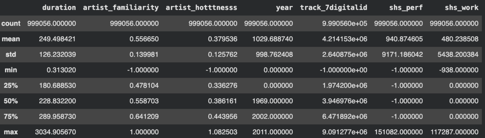

Immediately we noticed that features like artist familiarity, artist hotness and the shs performance score have minimum values of -1 or how year has a minimum value of 0 which could indicate missing values. So the distributions were plotted for further inspection.

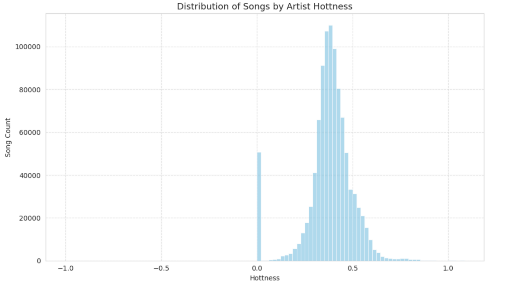
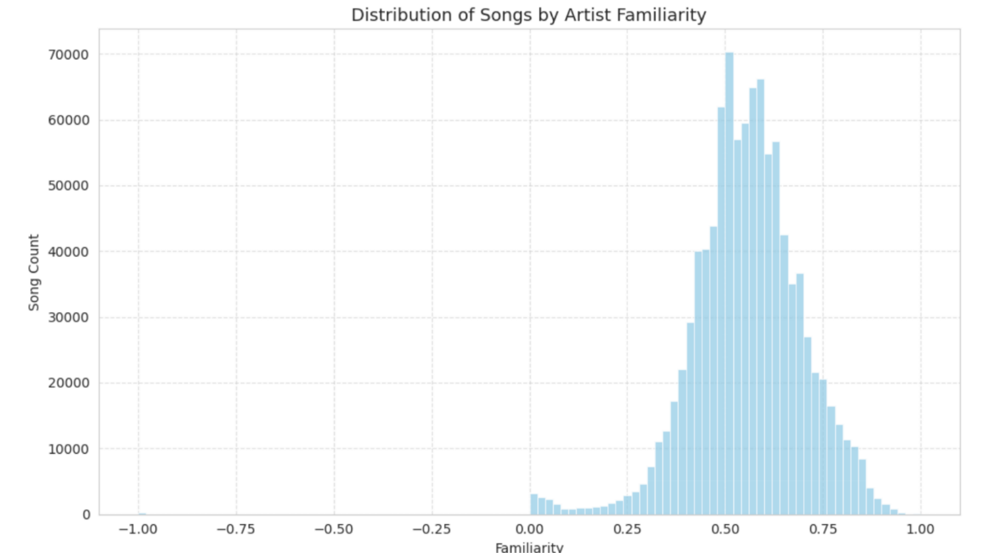
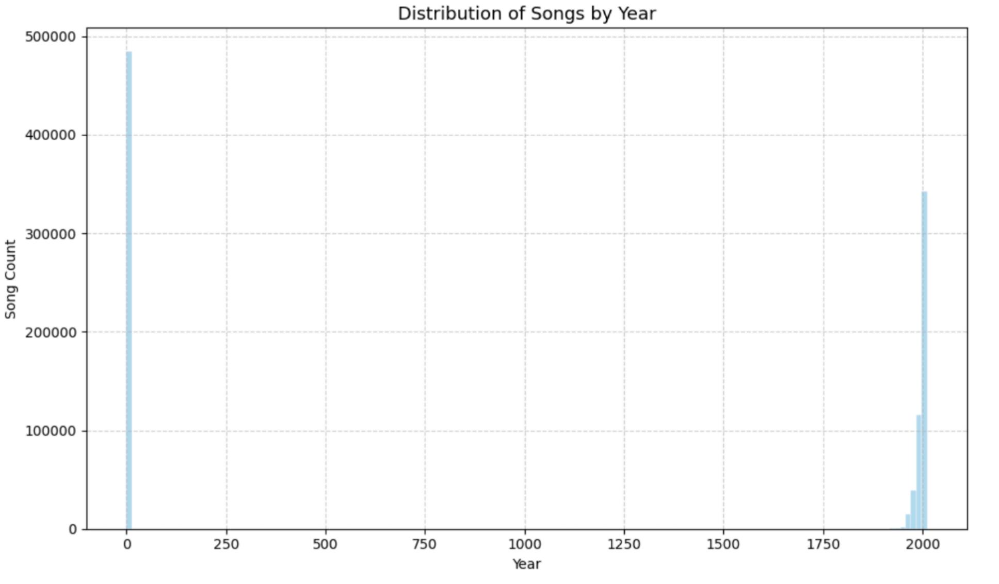

It turns out that -1 is the missingness indicator for artist hotness and artist familiarity, there are only 12 unknown values for artist hotness and 180 unknown values for artist familiarity, this is good since the more known data we have the better the insights. For the year variable, there is a large amount of unknowns since a song cannot have a year of 0. We uncovered that 484,284 songs have a year of 0. If we remove 0s then the distribution is much clearer, showing songs ranging from the 1950s up until the early 2000s.

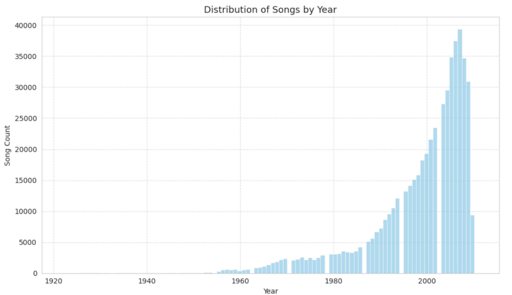

To explore the categorical labels, we looked at the genre labels via seaborn bar plots, which have majority and minority genres. The top majority and minority genre is rock, and the other most popular among both are electronic, pop. Metal is a more prevalent minority genre.

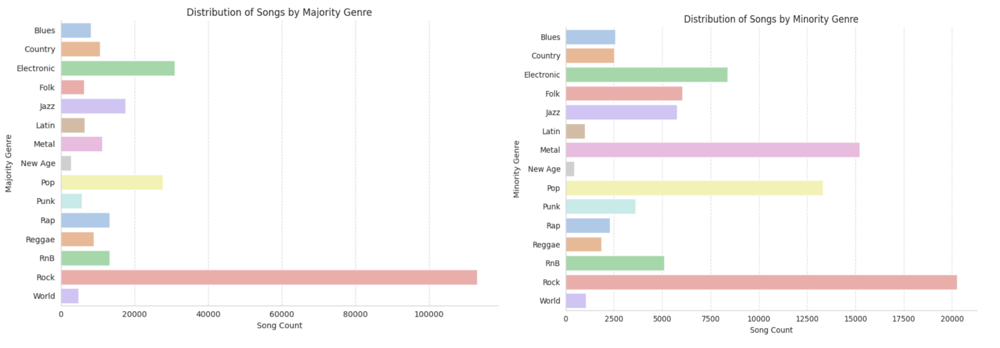

We also explored genre missingness using seaborn pie plots and noticed a large portion of missing data

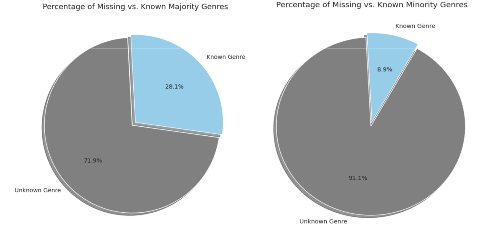

### The User-Song Dataframe

Using the describe function we saw the original dataframe has 48,373,586 rows and 3 columns, the columns are user_id, song_id and number of plays. We merge this dataframe with the track metadata dataframe from above to be able to gain more data on the songs users are playing. The dataframe has 384,546 unique songs and 1,019,318 unique users.

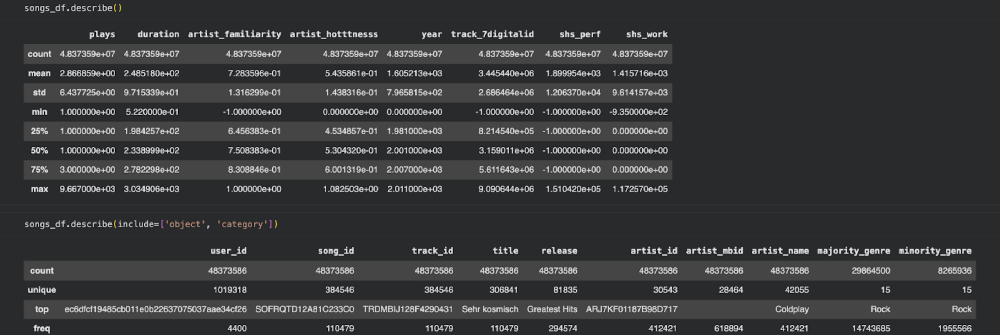

We plotted the distribution of song plays, which showed a right skewed distribution, so the majority of the plays are smaller than larger. Additionally, we used a stripplot as well in order to capture the outliers that weren’t being captured in the histogram and we can see some very large play counts, the largest visible play count nearing 700,000.

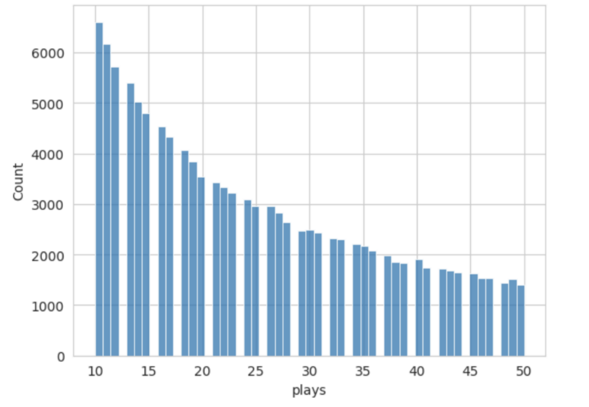
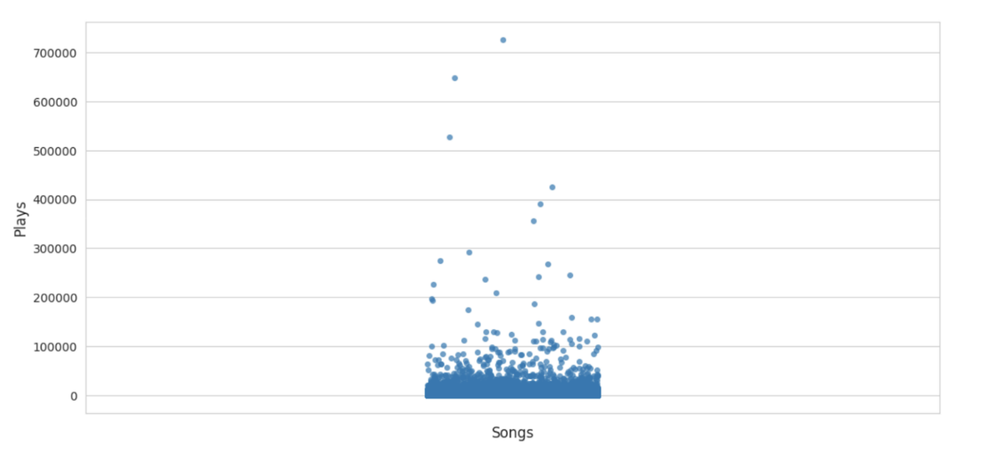

We looked at the genre distributions of the songs within the user-song dataframe with rock still heavily in the lead.

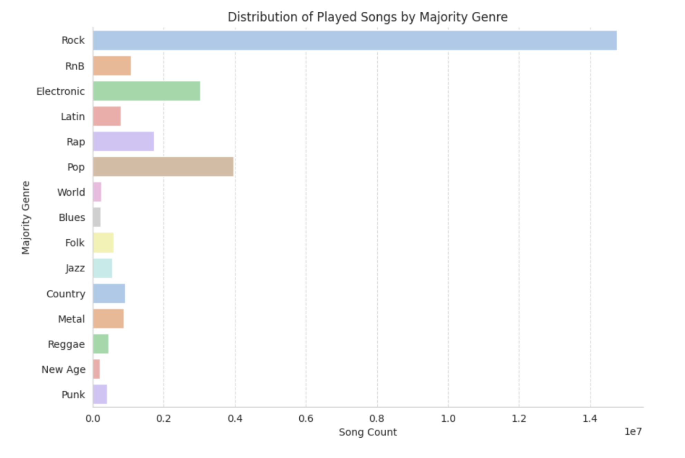

For the user–song interaction dataframe, via a seaborn pie plot, it was observed that 61.7% of the songs had identifiable genre labels, which is higher than the proportion observed in the full track-metadata dataframe. This is attributed to the lower number of unique songs included in the interaction dataframe.

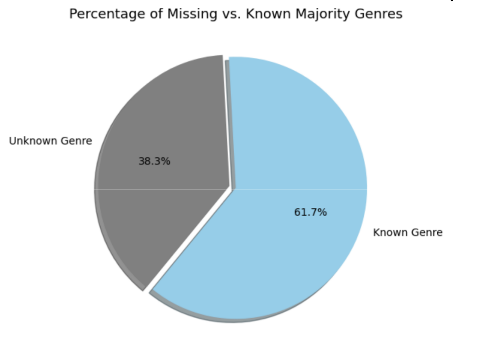

In order to find out more about the artists that were being listened to in the dataset, we visualized the top 15 most listened to artists using a barplot. Noticing once again the popularity of rock.

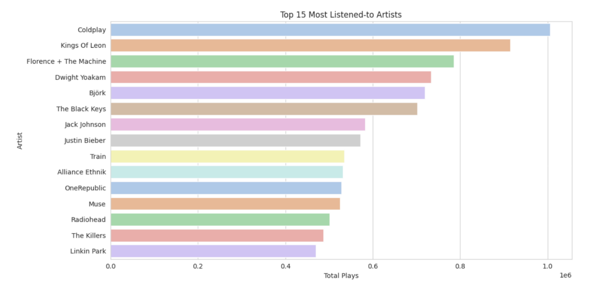

Other visualizations that were created were correlation heatmaps to see the correlation between numerical variables, if any. But we noticed very low correlations between most variables except artist hotness and artists similarity and shs perf and shs work which was expected. These visualizations and their code can be found in the milestone 2 plots notebook.

## Data Preprocessing

The data preprocessing section focused on outputting two dataframes: a song dataframe with song information and non aggregated user interactions and a user level dataframe for clustering.

The song dataframe:
For the first dataframe, mirroring what happened in the data exploration section above, the data (track metadata, user-song data, genre labels) was loaded into the notebook.  We then merged the track metadata with the genre labels on track id, then merged this with the user-song interaction data on song id. We then drop the rows with null genres and year as 0. We also created a new feature called total track time which multiplies the duration of a track with the total plays. This dataframe gets saved at the end of the notebook as a parquet file for easy access in subsequent steps. So what this is, is per every row we have a user id with a song they’ve listened to and all the song metadata.

The user level dataframe:
We took the dataset above and created a new one with user level info, so we had to do some aggregations. We grouped by user_id, and we computed user listening statistics. For each user, we calculated their total number of plays, total listening time, number of unique songs, and number of unique artists. We also identified preference-based attributes by selecting the most frequently occurring values within each user’s listening history. These included their most-listened artist, favorite majority and minority genres, most common release year among the tracks they listened to, and their most-played song. Together, these aggregated features formed a sort of “profile” for each user and were used as inputs for the clustering algorithms.

To prepare the user-level data for clustering, we dropped NaNs and visualized the data once again. To ensure better clustering, we filtered out users with insufficient or abnormal listening behavior. We kept only users who listened to more than 10 songs, had over 10 total plays, and accumulated at least one hour of listening time. We also required that their favorite song, artist, and year were played more than once, and that favorite songs had realistic durations (30 seconds to 10 minutes). To remove extreme outliers, we excluded power users with unusually high total play time or play counts, as well as users who listened to a single track for more than 10 hours. We visualized the data again, and then applied two different scaling methods to all numerical variables: Min-Max scaling and Robust scaling. Min–Max scaling transforms each feature to a 0–1 range, while Robust scaling standardizes values based on the median and interquartile range, making it less sensitive to extreme outliers. We computed both versions to compare their effects. Because the user-level features contained several skewed distributions and meaningful outliers like heavy listeners. Robust scaling was selected as the more appropriate normalization method for subsequent modeling.Because the dataset included some categorical features: user’s favorite majority genre, minority genre, and favorite artist, we converted these variables into numerical form using one-hot encoding. We saved the processed user dataset in Parquet format to enable efficient storage and future access. The encoded DataFrame was written to the shared ‘DSE 220 Final Project’ Google Drive folder.

For the next step of preprocessing, we loaded the processed user dataset from the Parquet file. Due to RAM issues, we had to drop the artist one hot encoded columns that we created prior since it created thousands. Subsequently, to reduce dimensionality and capture the most relevant patterns in the data, we applied Principal Component Analysis (PCA) on the numerical features, excluding the user_id column as it was not relevant for clustering. We retained enough components to explain 90% of the variance in the data (set parameter n_components=0.9). The PCA transformation produced a new set of features, with each principal component represented as a separate column in a new DataFrame. For dimensionality reduction for the second model, UMAP was used to reduce the data into 15 dimensions (set parameter n_component = 15), then UMAP looks at the 50 nearest neighbors of each point (set parameter n_neighbor = 50) and points cluster tightly(set parameter min_dist=0.0).

## Model 1: KMeans Clustering

To quickly explain, K-means clustering is an unsupervised machine learning method used to group data points into a number of clusters based on similarity. The algorithm works by assigning observations to the nearest cluster centroid and then updating the centroids to minimize the within-cluster variance. To determine the optimal number of clusters for our dataframe, we applied the elbow method using the PCA-transformed features. We evaluated k-means clustering across a range of cluster counts from 1 to 30 and recorded the corresponding inertia, which measures the within-cluster sum of squares. For each value of k, we also tracked the number of users assigned to each cluster. The resulting inertia values were plotted against the number of clusters via a line chart to visualize the "elbow point," which indicates the best number of clusters.

After identifying the optimal number of clusters, we decided to run the model with 9 and 26 clusters on separate iterations using scikit-learn's k-means algorithm. A new column was added to the user DataFrame to indicate each user’s cluster assignment. We evaluated the model by computing the silhouette score on a subset of 50,000 data points, due to the computational cost of evaluating the full dataset. Clusters were visualized across different principal components using pairplots and focused scatter plots, which are discussed further in the results section.

## Model 2: HDBSCAN

For our second approach, we applied UMAP (Uniform Manifold Approximation and Projection) and then a HDBSCAN (Hierarchical Density-Based Spatial Clustering of Applications with Noise). We then applied HDBSCAN, a density-based clustering algorithm that automatically identifies clusters and labels low-density points as noise. The algorithm ran with the minimum number of points in a cluster for it to be considered valid at 200 (set parameter min_cluster_size=200), the number of samples needed to be considered a core point was configured at 10 (set min_samples=10) and we use all cores to speed up computations (set n_jobs = -1). We assigned the resulting cluster labels to the user dataframe in a new column called hdb_cluster. We then inspected the clustering results by counting the number of unique clusters and examining the distribution of points across all clusters. To visualize how the clusters relate to basic listening metrics, we created a histogram of the HDBSCAN labels and a scatter plot comparing total_play_count and unique_artist_count against cluster assignments which we will further discuss in the results section. Lastly, we assign the HDBSCAN cluster numbers to each user in the user dataframe and drop unnecessary columns. The resulting dataframe has user_id, the KMeans cluster assignment and the HDBSCAN cluster assignment.

## Playlist Generation

To generate ‘playlists’ for each cluster, we first combined the two dataframes we ended up with, the song dataframe and the user clusters dataframe. This merge created a single dataset that included each user’s plays, the corresponding song attributes, and the cluster assignments from both KMeans and HDBSCAN. We then selected the relevant variables to keep. Next, we computed global popularity by summing the total number of plays for each song across all users. This provides context on whether a track is widely listened to overall or only within specific clusters.

For playlist creation, we aggregated the data separately for KMeans and HDBSCAN. For each clustering method, we grouped the data by cluster and song, summed the play counts within each cluster, and sorted songs in descending order of cluster-specific popularity. From these ranked lists, we selected the top 20 most-played songs for every cluster. Finally, we joined these top songs back with the song metadata. So we have 20 songs and their info for each cluster for each clustering algorithm. To evaluate this, we looked at specific user ids, created a dataframe with that user’s top 20 songs and compared that to the songs in the user’s assigned cluster playlist. We then further evaluated the clusters.

---

# Results Section

Preprocessing results:
After removing null genres and years, we see that the mean year for our song dataset is 1998 and we can see the distribution of songs across our numeric variables and genres. The pairplot shows that the four main numerical attributes of the dataset (duration, artist familiarity, artist hotness, and year) don't really form distinct clusters by genre. Duration is highly skewed, year shows a spike in songs in the 2000, and artist familiarity and hotness are concentrated around mid-range values with only a weak correlation between them. These features do not provide strong separation across genres.

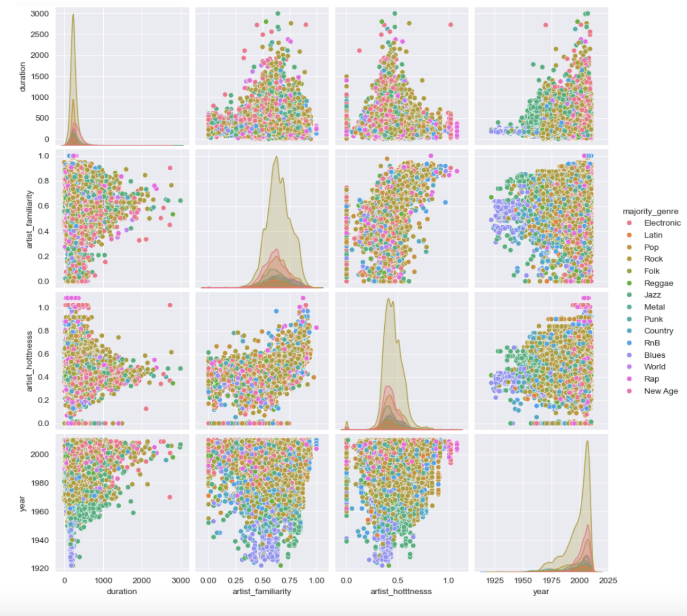

After filtering and scaling the user data, the correlation matrix shows that most user activity features, such as total plays, total play time, unique songs, and unique artists, are strongly correlated. In contrast, attributes tied to favorite items (favorite year, favorite song duration, etc.) show very weak correlations with other features.

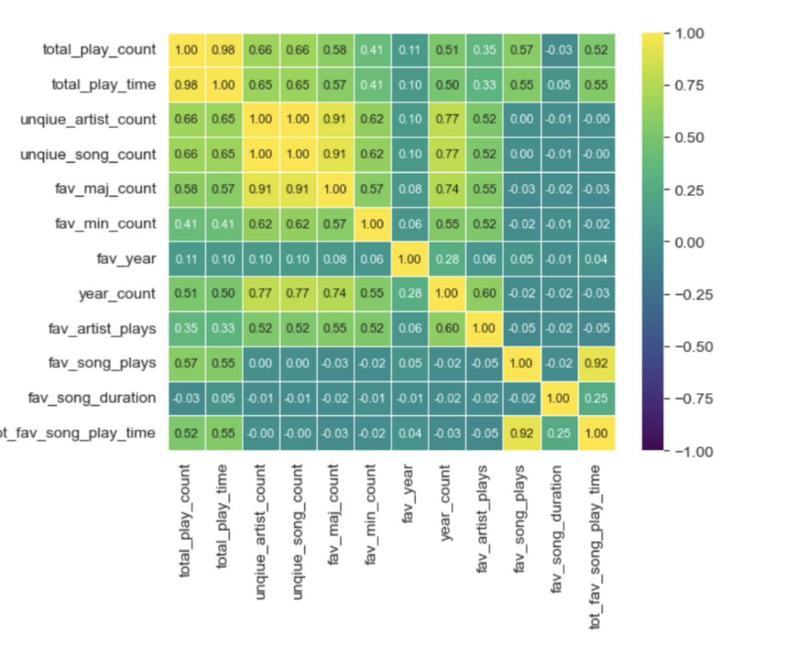

For dimensionality reduction, after conducting PCA we saw that 8 components captured 90% of the variation in the data. The PCA results show that the first component explains 37.75% of the variance, followed by 23.79%, 9.99%, 7.29%, 6.60%, 2.21%, 2.01%, and 1.55% for components 2 through 8. Together, these components capture 91.19% of the total variance in the dataset. So this new reduced dataset is used in Kmeans. UMAP required manual choosing of components which is explained in the discussion section. For the elbow method to select clusters, the visual suggested that the optimal number of clusters was at around 9.

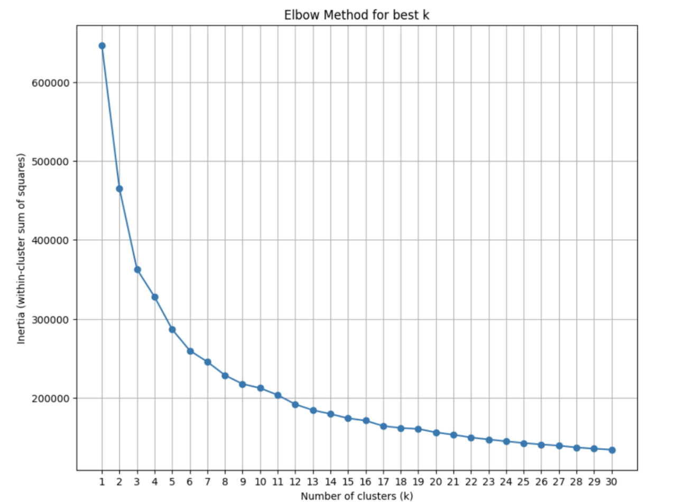

But after observing the results of the heatmaps that were created to visualize the distributions of points per cluster, we noticed that the point-to-cluster-assignment was more evenly distributed when reaching higher numbers of clusters (shown below).

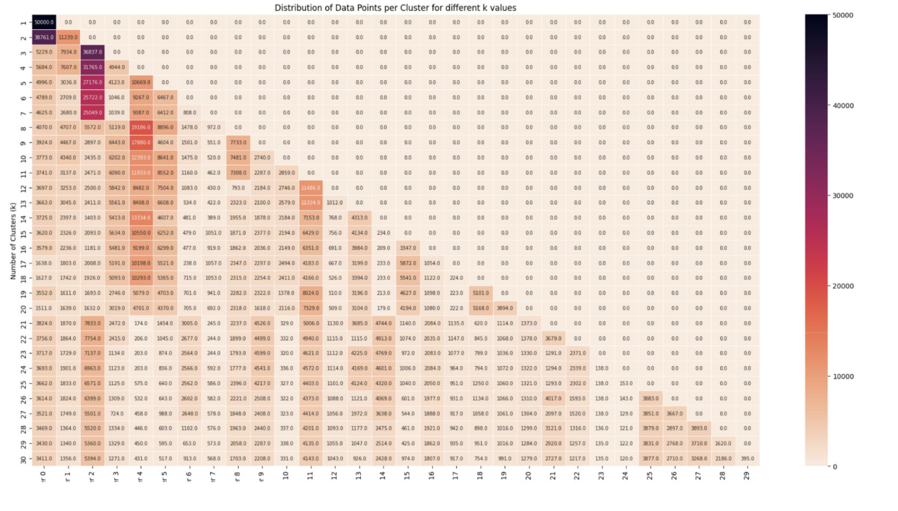

KMeans:
The K-Means model produced a silhouette score of 0.133, indicating that the clusters were only weakly separated and that users showed overlap in their listening behavior. This suggested that the underlying structure of the data was not strongly linear. Cluster sizes ranged from 1432 to 55442 data points, reflecting a significant degree of imbalance even after increasing the number of clusters from 9 to 26. Below is the K-means clustering results projected onto the fourth and fifth principal components. Each point represents a user, and colors denote the 26 cluster assignments. The visualization shows lots of overlap among clusters. Most points are concentrated in a dense central region with substantial mixing of colors, indicating limited separation between groups.

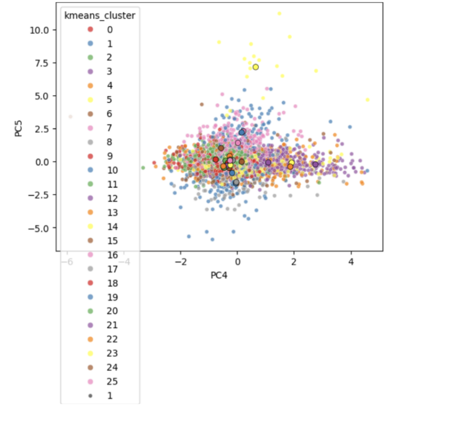

HDBSCAN:
HDBSCAN automatically selected 151 clusters as the optimal amount. HDBSCAN identified many small, dense clusters along with a substantial number of noise points, indicating that the dataset contains complex, granular structure rather than a few well-separated groups. The projection shows clusters overlapping and radiating outward. Overall, the results suggest meaningful local structure but no strong global segmentation in the data.

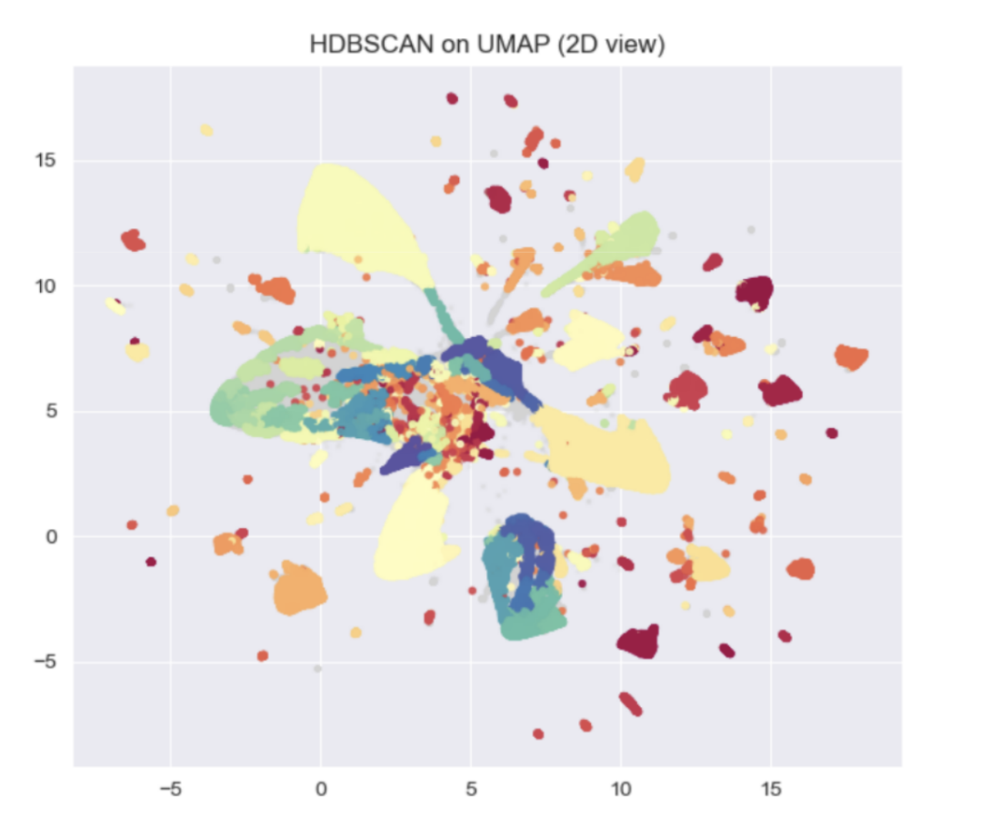

Playlist Results:
To test our recommendations, we would need to be able to see how users react to our recommendations. Since we cannot do so without a real application and users, to evaluate we picked an arbitrary user and checked to see if the recommendations made sense. We show in notebook “4. DSE 220 Milestone 4 Song Recommendation.ipynb” the top 8 songs for the user, the KMeans cluster of the user, and the HDBSCAN cluster of the user:

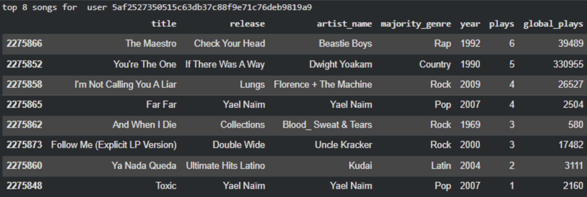
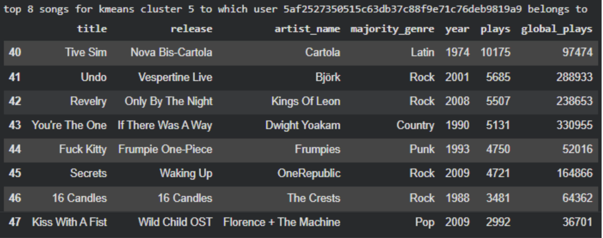
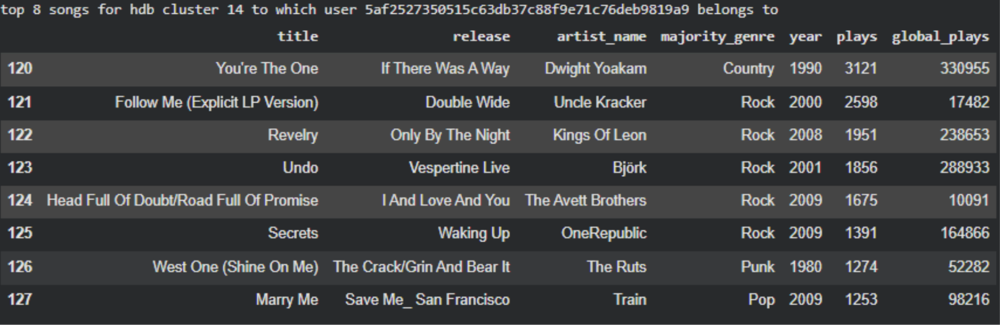

Upon an initial look, we notice that there seems to be strong overlap between the genres, but that it’s not a 100% match. This is good, because the goal of song recommendation is to show new music to users, not limited to a specific genre (note country music being #1 in the HDBSCAN cluster, which is not found in the user’s top songs). For other metrics, it is hard to tell at a glance, so we display the intersection between the top songs of the user and their clusters across four different metrics: common songs, common artists, common genres, and common years.

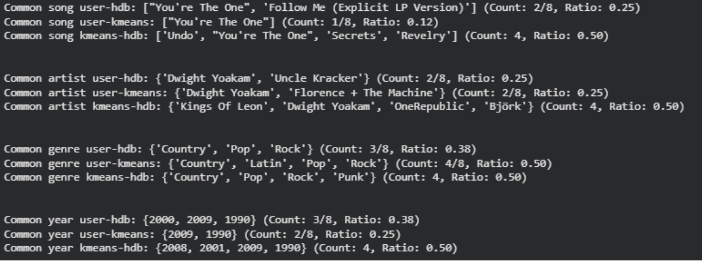

Common genre: We see a higher overlap for common genres than we do for the other metrics between the user and their clusters. We expected this, because we thought genres would be the most significant variable that would link users together.

Common songs, artists, and years: We see that among the top songs, that the user has two overlaps with the HDBSCAN cluster, and one overlap with the KMeans cluster. This validates that we are on track, as it is likely that a user would like popular songs in the cluster. If we discovered that there was a very high overlap, then that could be a sign of overfitting. Similarly, if there was no overlap at all, that would be a sign of underfitting.  Conversely, it is good to see that between the two clustering algorithms, that there is a 50% overlap between the KMeans and HDBSCAN clusters, as it indicates that perhaps the models are producing similar user groups. We see similar results for artists and years. Notably, the 50% overlap between clustering models exists for all metrics.

---

# Discussion Section

EDA:
Exploratory Data Analysis is a crucial step as it allows us to understand the structure, quality, and underlying patterns in the data before applying any modeling or analysis techniques. In this project, EDA was conducted on both the track metadata and user-song interaction data from the Million Song Dataset to uncover missing values, outliers, and overall distributions of the features.
Bar charts were used to visualize categorical variables, such as genres and top artists, because they clearly display the frequency or count of each category, making it easy to compare relative popularity or representation. Histograms were used to visualize numerical variables, such as song duration, artist familiarity, and number of song plays, because they show the distribution of values across the dataset, highlighting trends like skewness, clusters, and the presence of outliers. For example, plotting the distribution of song plays revealed a right-skewed pattern, where most songs have low play counts but a few have extremely high counts, which was further clarified using a stripplot to capture the extreme outliers. It's necessary to understand the data before working with it.

Preprocessing:
Preprocessing is almost always necessary before running models. The two datasets that were produced were needed for the playlist generation step. We ultimately needed a dataframe with user ids and cluster assignments and then the actual user-song interactions to find the user’s top songs and the song’s information. This way we could see each user’s preferences and find top songs by clusters and compare. We dropped rows with missing genres and year because as a couple of our only categorical features we wanted to make sure we had this information for every song.Categorical features, including favorite genres and artist, were converted to numerical form using one-hot encoding to allow clustering algorithms to process them effectively. Numerical variables were scaled using both Min-Max and Robust scaling to handle differences in ranges and mitigate the influence of outliers, with Robust scaling ultimately selected due to the presence of extreme values from heavy listeners.

Due to memory constraints, high-dimensional artist one-hot columns were removed to reduce computational complexity. Principal Component Analysis (PCA) was applied to the numerical features because it captures the most relevant patterns while reducing dimensionality. Retaining components that explained 90% of the variance ensured that most of the meaningful information in the dataset was preserved. The elbow method was applied to PCA-transformed features because it helps determine the optimal number of clusters. We plotted the distribution of data points over a number of clusters (described in the results section) which illustrated that the higher number of clusters created a more even distribution of points among clusters. This fueled our decision to change the number of clusters from 9 to 26.

KMeans:
K-means clustering was chosen for this project because it is a well-established method for segmenting users based on numerical features (in this case their listening behavior). Its simplicity and scalability make it suitable for large datasets like the Million Song Dataset. By grouping users with similar patterns in total plays, preferred genres, and favorite artists, K-means helps find relevant songs in each cluster.

HDBSCAN:
The HDBSCAN-UMAP pipeline was chosen as a complementary approach to the K-means-PCA pipeline to try and capture non-linear patterns in user behavior.

---

# Conclusion

In this project, we explored two clustering approaches: K-means and HDBSCAN, to segment users based on their listening behavior and generate song recommendations. We chose the filtering primarily after we ran the models and evaluated them and the model outputs improved significantly with better feature engineering. Augmenting our data with genre labels was helpful in helping the models distinguish between the different clusters based on genre. Getting rid of the nans for years and the genre labels also helped make the clusters more realistic.  Similarly, getting rid of the extreme outliers and users we deemed ‘non repeat customers’ helped with ensuring there were fewer unrealistic clusters.

The playlist that we created for our chosen user had a couple of songs that we know the user liked as they were in their top songs, and the genres, artists, and years also mapped similarly. We believe this is a good sign, as a couple of overlaps indicates that we are neither underfitting nor overfitting. However, unless and until we get explicit user feedback, we can’t really know if the user liked the playlist. So other than coming up with these inspection metrics we have no clear method for evaluating the real success (user liked the song recommendation) of our models.

While these methods successfully grouped users into clusters, the lack of detailed song-level features limited the ability of the algorithms to capture more nuanced preferences. There was a limitation in obtaining the full dataset so we were only able to work with some of the data provided, there wasn’t a lot of information about each song. Likewise, the user-user interactions that could be derived via shared songs or shared genre would also be helpful for measuring similarity between two users. Future directions involve using a dataset that has more song information to create better clusters and try recommending songs the user hasn’t already listened to. We also have one hot encoded artist_id and song_ids that we did not add to our model due to compute limitations. Adding those could definitely improve the model.

While using traditional machine learning methods are able to create a recommendation system, the core of the data in this case involves interactions between users and songs. This sort of problem is very much suitable for graph based machine learning methods. Users and songs form a bipartite graph where the plays are the set of edges with the play counts being the edge. The bipartite graph can then simply be used to create simple communities based on which users listen to the same songs. The infographic below explains the process for ‘folding/projecting’ bipartite graphs to create clusters.
Just as an exploration for future directions for the project, we also converted the user-songs-plays data into a neo4j graph (a snippet shown below) and used the louvain algorithm to generate communities
Genre nodes are in black, artist nodes are in gray, song nodes are in green and the users are colored based on the cluster determined using the Louvain algorithm. Now we can use these communities to recommend songs and as we get feedback from the user, we can update the weights for the edges over time and generate updated clusters.

Just as an exploration for future directions for the project, we also converted the user-songs-plays data into a neo4j graph (a snippet shown below) and used the louvain algorithm to generate communities

Genre nodes are in black, artist nodes are in gray, song nodes are in green and the users are colored based on the cluster determined using the Louvain algorithm. Now we can use these communities to recommend songs and as we get feedback from the user, we can update the weights for the edges over time and generate updated clusters.

---

# Statement of Collaboration
Faizan Haque: Project Leader, Developer, Visionary: Organized meetings, wrote code, generate plots, initial exploration of dataset, designed the metrics for model evaluation, came up with vision and mindmap for the project

Chayan Tronson: Lead Developer: Wrote code, ran models, managed notebooks and data files, setup git repository, worked on report and documentation.

Isabella Gonzalez: Lead Artist, Documentation, and Design: Wrote core of report and README, located dataset, added testing metrics, beautified EDA.
